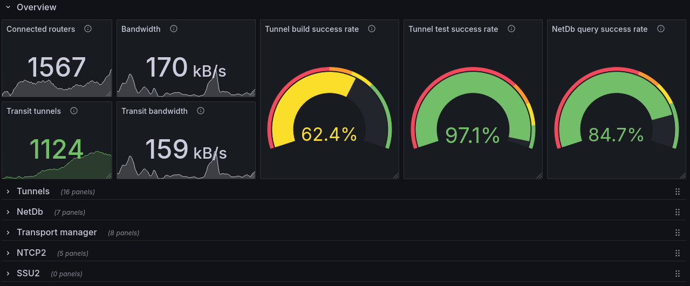

# Debugging `emissary`

## Running with debug info

When running `emissary` for development purposes, using `cargo run --profile testnet` is recommended. The `testnet` profile enables optimizations, debug assertions and overflow checks.

## Prometheus and Grafana

The `metrics` feature must be enabled for `emissary-util`. To run `emissary-cli` with the debug profile and metrics, use:

```bash
cargo run \
  --profile testnet \
  --no-default-features \
  --features=metrics \
  -- \
  --metrics-server-port 7799
```

Start Prometheus:

```bash
prometheus --config.file resources/prometheus.yml
```

`resources/dashboard.json` contains the JSON Model for a router dashboard which can be exported to Grafana:



## Logging

There are 5 logging levels, ordered by increasing verbosity: `ERROR`, `WARN`, `INFO`, `DEBUG` and `TRACE`.

Each subsystem in `emissary` has a logging target which allows enabling, disabling and adjusting the logging level of that subsystem individually. It's possible to, e.g., enable `TRACE` for SSU2, disable logging for NTCP2 entirely and set the logging level of the tunnel subsystem to `DEBUG`.

By default, `INFO` is enabled for all logging targets.

### Examples

Enable full trace logging for all subsystems:

```bash
emissary-cli -lemissary=trace
```

Set default logging level to `WARN`, enable `DEBUG` for the tunnel subsystem and `TRACE` for NTCP2 and SSU2:

```bash
emissary-cli -lemissary=warn,emissary::tunnel=debug,emissary::ntcp2,emissary::ssu2=trace
```

Enable `TRACE` for transit tunnels and turn off tunnel pool-related logging:

```bash
emissary-cli -lemissary::tunnel::transit=trace,emissary::tunnel::pool=off
```

`emissary` has support for three logging presets which are just a shorthand for enabling/disabling several subsystems. All these turn off logging for `emissary::tunnel::pool`.

* `i2cp`
  * enable `TRACE` for all I2CP-related subsystems
* `sam`
  * enable `TRACE` for all SAM-related subsystems, including [`yosemite`](https://github.com/altonen/yosemite)
* `transit`
  * enable `TRACE` for transit tunnels and `DEBUG` for transport manager

Start `emissary` with full `TRACE`-level logging for SAM and related subsystems:

```bash
emissary-cli -lsam
```

All logging targets can be found with:

```bash
grep -R --exclude-dir={.git,target,docs,examples} "const LOG_TARGET" .
```
